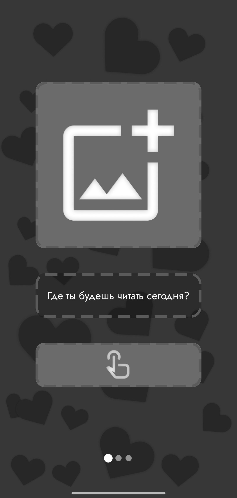
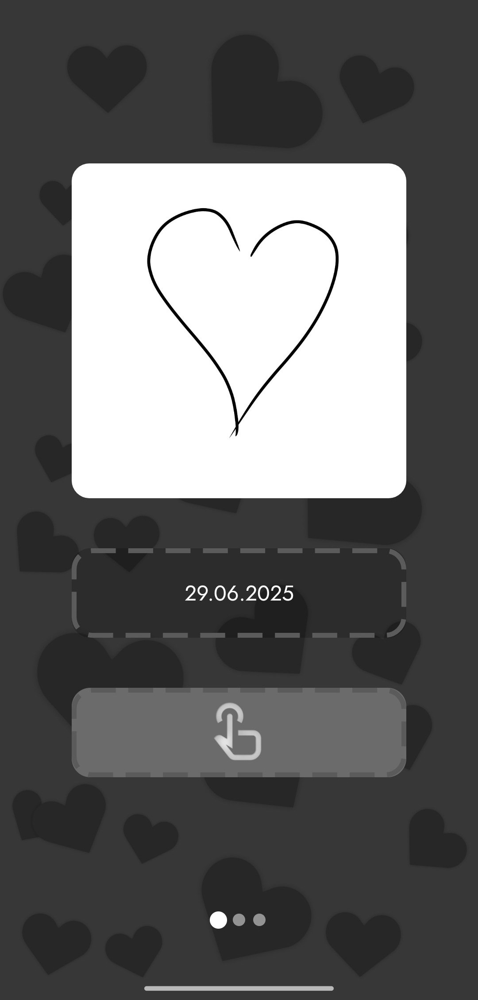
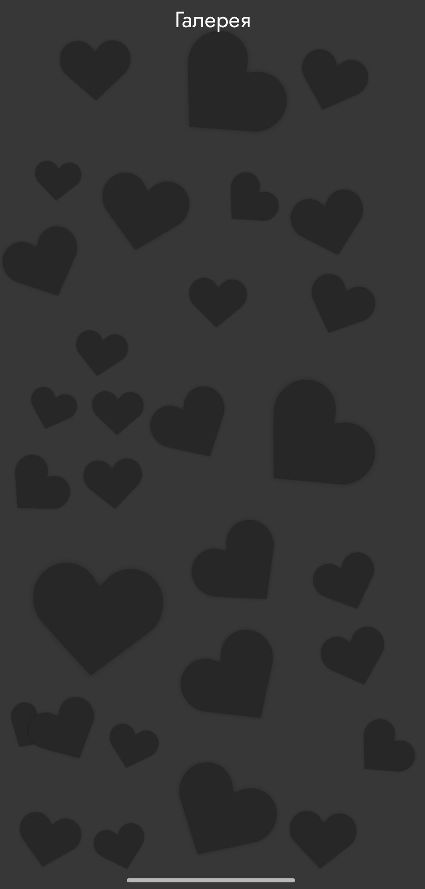
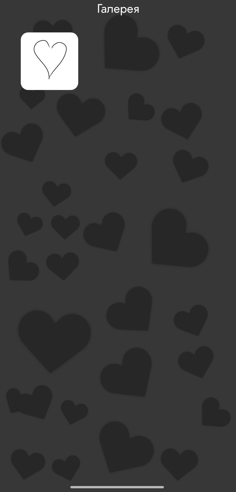
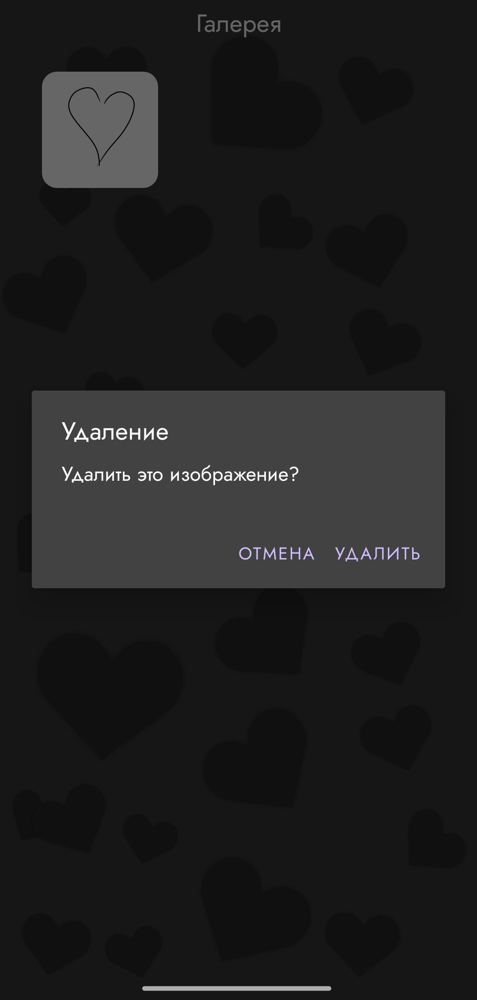
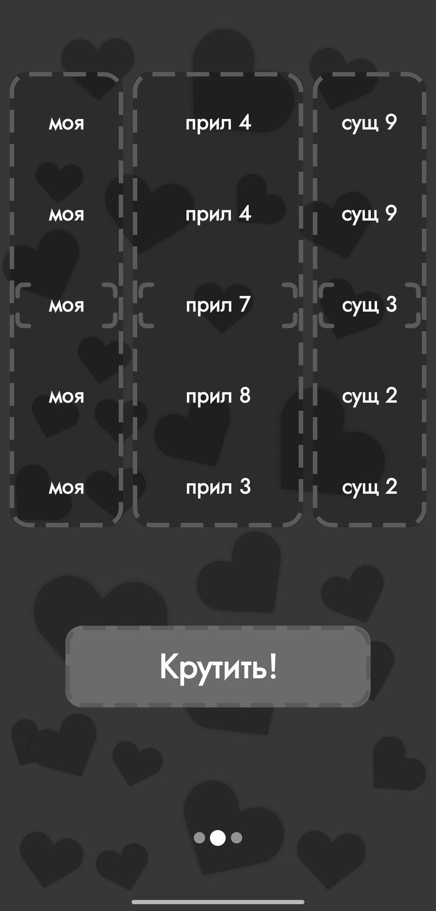
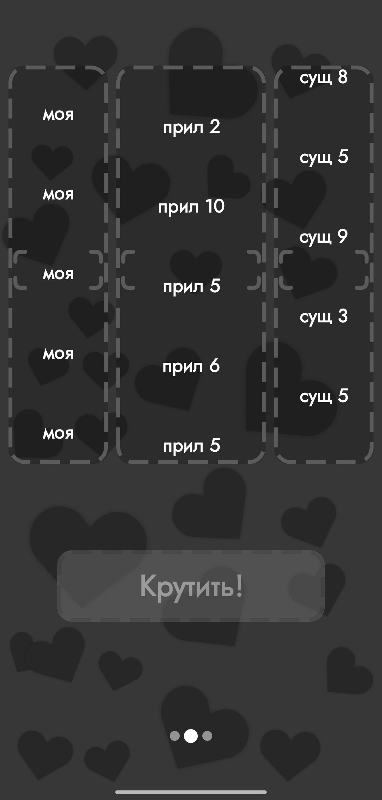
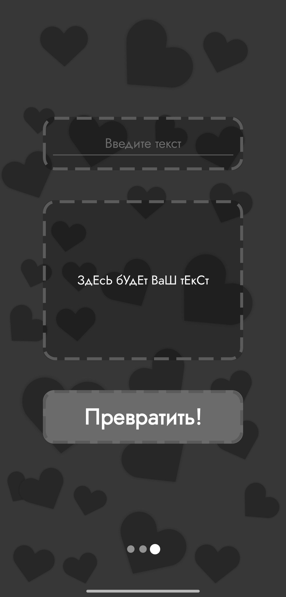
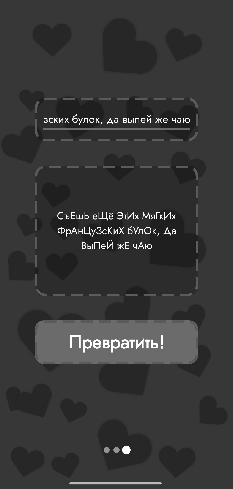

# English:
### This is a public version of an app I made for my girlfriend. Personal information has been removes and replaced with placeholders.
Have only Russian translate
## Screenshots:

<table>
  <tr>
    <td></td>
    <td></td>
    <td></td>
  </tr>
  <tr>
    <td></td>
    <td></td>
    <td></td>
  </tr>
  <tr>
    <td></td>
    <td></td>
    <td></td>
  </tr>
</table>

### Made in honor of Masha.

---

# Русский:
### Это публичная версия приложения, которое я сделал для своей девушки. Личная информация была удалена и заменена заглушками.
Have only Russian translate
## Демонстрация приложения:

<table>
  <tr>
    <td></td>
    <td></td>
    <td></td>
  </tr>
  <tr>
    <td></td>
    <td></td>
    <td></td>
  </tr>
  <tr>
    <td></td>
    <td></td>
    <td></td>
  </tr>
</table>

### Создано в честь Маши.
